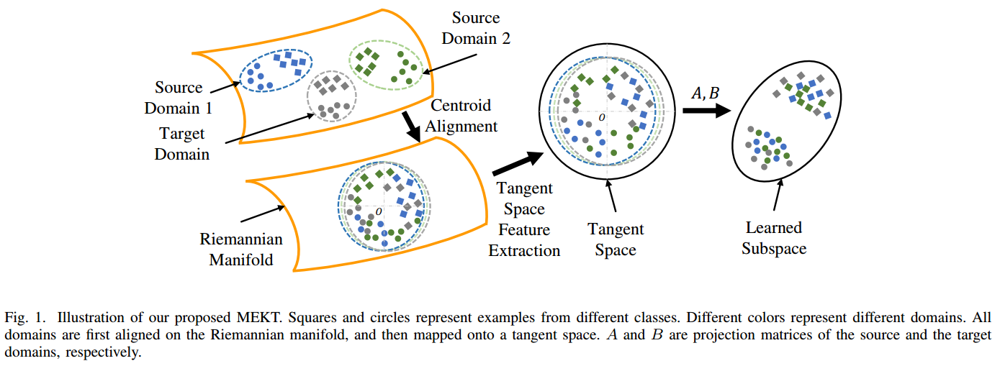

## Manifold Embedded Knowledge Transfer for Brain-Computer Interfaces

This repository contains code of manifold embedded knowledge transfer (MEKT). MEKT is a novel transfer learning framework for offline unsupervised cross-subject electroencephalogram (EEG) classification. It can cope with variations among different individuals and/or tasks in unsupervised scenarios, and has achieved superior performance.

<div align="center">
    
</div>

The average BCAs on the four datasets are shown in Table II. All MEKT-based approaches outperform the baselines. 

<div align="center">
    
</div>

The results on STS/MTS tasks above demonstrate the effectiveness of our approach.

## Running the code
The code is MATLAB code works in Windows 10 system. And the matlab covariancetoolbox (https://github.com/alexandrebarachant/covariancetoolbox) should be downloaded and included in your toolbox.

Code files introduction:

**demo_mi1_sts.m** -- Single-source to Single-target (STS) tasks on MI dataset 1, run this demo file in MATLAB could show the performance similar to our paper. It contains the dataset test, MEKT approach function, and DTE test sections.

**demo_mi2_mts.m** -- Multi-source to Single-target (MTS) tasks on MI2 dataset.

**demo_rsvp_sts.m** -- STS tasks on RSVP dataset. The augmented covariance matrix is used here.

**demo_ern_mts.m** -- MTS tasks on ERN dataset. The augmented covariance matrix is used here.

**dte_rsvp.m** -- Domain transferability estimation (DTE) to select source domains, tested on RSVP dataset.

**MEKT.m** -- It's the implementation of MEKT approach. Please find the specific input/output instructions in the function comments.

**demo_view_fig4.m** -- reproduce the visualization of data with MEKT-R in Fig. 4.


## Citation

This code is corresponding to our TNSRE 2020 paper below:

```
@Article{zhang2020manifold,
  title={Manifold Embedded Knowledge Transfer for Brain-Computer Interfaces},
  author={Zhang, Wen and Wu, Dongrui},
  journal={IEEE Trans. on Neural Systems and Rehabilitation Engineering},
  volume={28},
  number={5},
  pages={1117--1127},
  year={2020}
}
```

